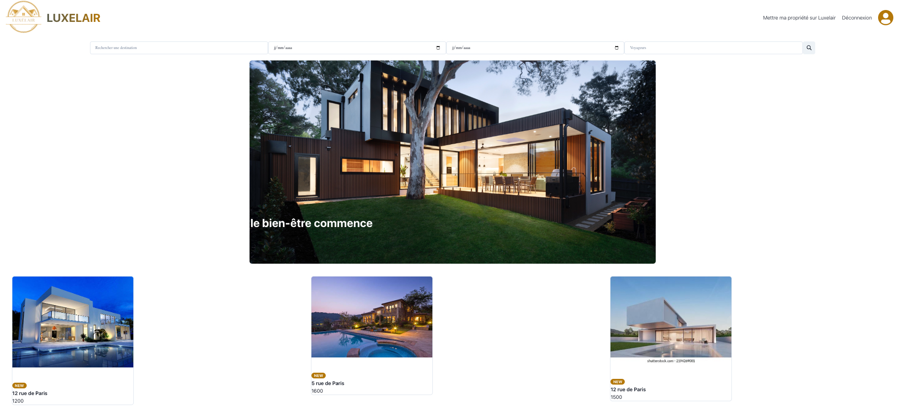
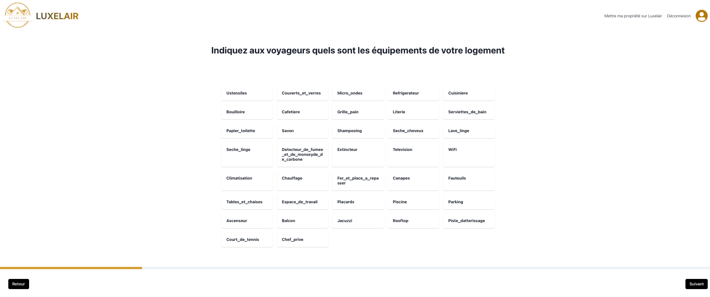
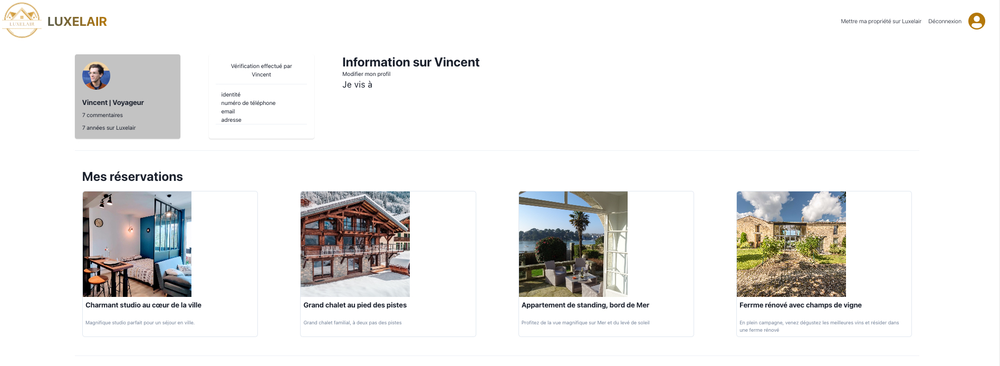

<h1 align="center" id="title">Luxelair</h1>

<p align="center"></p>

<p id="description">Le projet Luxelair, conçu par une équipe de trois développeurs, a été développé dans le cadre de notre programme d'alternance en tant que Concepteur Développeur d'Applications. LuxeLair est une plateforme de réservation de logement de luxe. Notre MVP inclut des fonctionnalités telles que la publication d'annonces gestion des annonces la possibilité de faire une réservation le paiement et la gestion des réservations.</p>

<h2>🚀 Demo</h2>

[https://0923-orange-1.wns.wilders.dev/](https://0923-orange-1.wns.wilders.dev/)

<h2>Projet Screenshots:</h2>

<div style="display: flex; justify-content: center;">
    <div style="display: flex;">
        
        
    </div>
</div>

<div style="display: flex; justify-content: center; margin-top: 1rem">
    <div style="display: flex;">
        
    </div>
</div>

<h2>🧐 Fonctionnalités</h2>

Voici quelques-unes des features du projet:

- Gestion des réservations
- Consultation des réservations
- Paiement
- Publication d'une annonce
- Création d'un compte utilisateur
- Connexion et Déconnexion
- Faire une réservation
- Faire une recherche des logements
- Modifications de ses informations personnelles

<h2>🛠️ Etapes d'installation</h2>

<p>1. Cloner le projet</p>

```
git clone git@github.com:vravanel/luxelair.git
```

<p>2. Se déplacer dans le dossier projet</p>

```
cd luxelair
```

<h3> Si vous utilisez docker: </h3>

<p>Lancer le container docker</p>

```
make run-dev
```

<h3> Si vous n'utilisez pas docker: </h3>

<p>1. Installer les dépendances</p>

```
cd back-end
npm install
cd ..
cd web-app
npm install
cd ..
```

<p>2. Démarrer le server back-end</p>

```
cd back-end
npm run dev
```

<p>3. Démarrer le server front-end</p>

```
cd web-app
npm run dev
```

<h2>🛠️ Générer des types GraphQL</h2>

```
cd web-app
npm run graphql-codegen
```

<h2>💻 Stacks/Outils utilisés</h2>

<ul style="list-style-type: none; padding: 0;">
    <li>
        <a href="https://www.typescriptlang.org/" target="_blank" rel="noreferrer">
            
            TypeScript
        </a>
    </li>
    <li>
        <a href="https://nextjs.org/" target="_blank" rel="noreferrer">
            
            Next.js
        </a>
    </li>
    <li>
        <a href="https://typeorm.io/" target="_blank" rel="noreferrer">
            TypeORM
        </a>
    </li>
    <li>
        <a href="https://www.apollographql.com/" target="_blank" rel="noreferrer">
            Apollo Server
        </a>
    </li>
    <li>
        <a href="https://graphql.org/" target="_blank" rel="noreferrer">
            
            GraphQL
        </a>
    </li>
    <li>
        <a href="https://www.postgresql.org/" target="_blank" rel="noreferrer">
            
            PostgreSQL
        </a>
    </li>
    <li>
        <a href="https://www.docker.com/" target="_blank" rel="noreferrer">
            
            Docker
        </a>
    </li>
    <li>
        <a href="https://chakra-ui.com/" target="_blank" rel="noreferrer">
            Chakra UI
        </a>
    </li>
    <li>
        <a href="https://jestjs.io/" target="_blank" rel="noreferrer">
            
            Jest
        </a>
    </li>
</ul>

## Guide de déploiement

[Guide de déploiement](./documentation/README.md)
